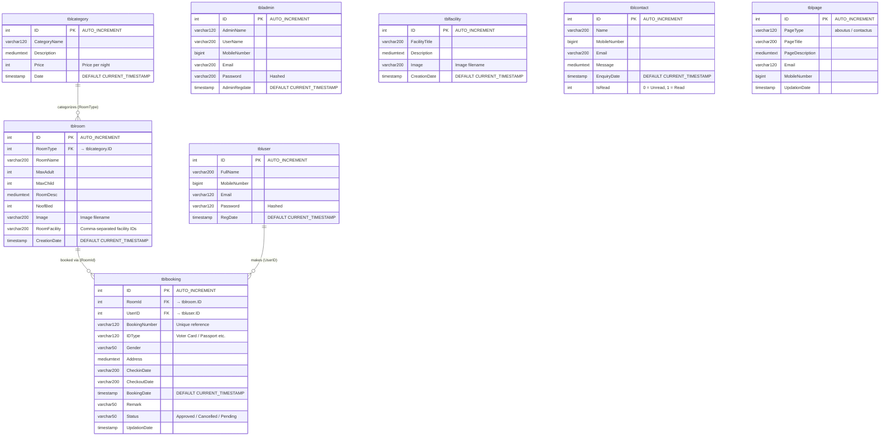

# HBMS — Database Diagram

**Database**: `hbmsdb` · **Engine**: InnoDB · **Charset**: utf8mb4 · **DBMS**: MySQL 8.0

---

## Entity-Relationship Diagram

> Render with any Mermaid-compatible viewer (GitHub, VS Code Mermaid Preview extension, etc.)



---

## Tables at a Glance

| Table | Rows (seed) | Purpose |
|---|---|---|
| `tblcategory` | 5 | Room types — Single, Double, Triple, Quad, Queen |
| `tblroom` | 6 | Individual rooms belonging to a category |
| `tbluser` | 4 | Registered customer accounts |
| `tblbooking` | 5 | Room reservations made by customers |
| `tbladmin` | 1 | Hotel admin accounts |
| `tblfacility` | 8 | Hotel amenities shown on the website |
| `tblcontact` | 1 | Enquiries submitted via the contact form |
| `tblpage` | 2 | CMS content — About Us & Contact Us |

---

## Relationships

```
tblcategory ──< tblroom        (one category → many rooms)
    tblroom ──< tblbooking     (one room → many bookings)
    tbluser ──< tblbooking     (one user → many bookings)
```

> **Note:** Foreign keys are enforced at the application layer (PHP/PDO), not as MySQL `FOREIGN KEY` constraints in the schema.

---

## Standalone Tables (no FK links)

| Table | Reason |
|---|---|
| `tbladmin` | Separate auth system; not linked to `tbluser` |
| `tblfacility` | Referenced loosely via `tblroom.RoomFacility` (comma-separated IDs, no FK) |
| `tblcontact` | Anonymous enquiries — no `UserID` link |
| `tblpage` | Static CMS content — no relational links |

---

## Soft Link: `tblroom.RoomFacility`

`tblroom.RoomFacility` stores a **comma-separated list of `tblfacility.ID` values**
(e.g., `"1,3,5"`). This is a denormalised many-to-many shortcut — there is no
junction table. The application parses the string to display facility icons per room.

---

## Booking Status Values

| Status | Meaning |
|---|---|
| `Approved` | Admin has confirmed the booking |
| `Cancelled` | Booking was cancelled (by user or admin) |
| *(pending/empty)* | Awaiting admin review |

---

## Connection Details (Docker)

| Setting | Value |
|---|---|
| Host | `db` (Docker service name) |
| Port | `3306` |
| Database | `hbmsdb` |
| User | `root` |
| Method | PDO (PHP) |
| phpMyAdmin | `localhost:8081` |
